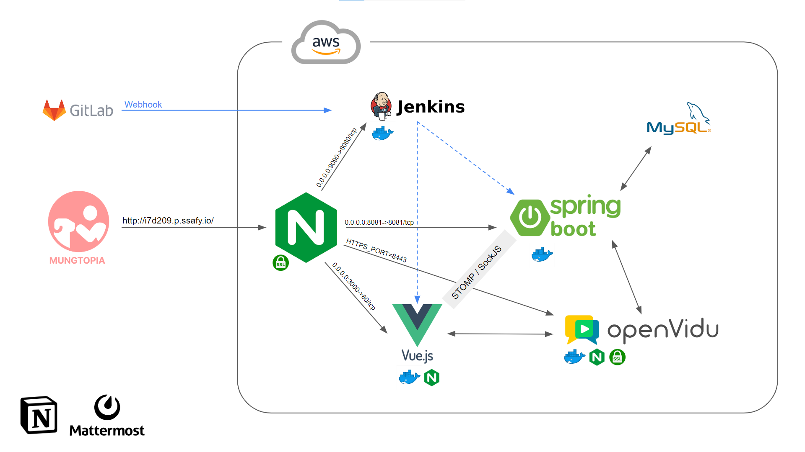

## Index

1. 멍토피아(Mungtopia) 서비스 이름 & 소개
2. 주요 기술 스택
3. 개발 기간 및 팀원 역할 소개
4. 프로젝트 특장점
5. 기술 특이점

# 1. 멍토피아(Mungtopia) 서비스 이름 & 소개

멍토피아는 '강아지와 함께할 수 있는 유토피아를 꿈꾼다' 라는 뜻을 가지고 있습니다.

멍토피아에서 여러분의 새로운 가족을 만나보세요!

## 1.1 주요 서비스 화면

# 2. 주요 기술 스택

* 형상관리 : Gitlab
* 이슈관리 : Jira
* 커뮤니케이션 : Mattermost
* 디자인 : Figma
* OS : Window 10
* DB : MySQL (8.0.29)
* Front-end
  * Node.js (16.16.0)
  * Vue3
* Back-end
  * Java 11
  * Springboot & JPA
* Deployment
  * AWS
  * Jenkins

# 3. 개발 기간 및 팀원 역할 소개

### 개발 기간

2022.07.11 ~ 2022.08.19 (6주)

### 팀원

* 황희원 (팀장/FE)
  * 목업(Figma) 디자인
  * 컴포넌트 구현 및 CSS(게시판 / 마이페이지 / 입양관리 / 게임 )
  * WebRTC (FE 기능 구현)
* 이미현 (팀원/BE)
  * DB 설계 및 구축 / JPA 도메인 설계
  * 게시판 API 개발
  * 채팅 구현 (STOMP, SockJS)
  * 배포환경 구축
  * WebRTC (Openvidu 서버 배포)
* 이연정 (팀원/BE)
  * DB 설계 및 구축 / JPA 도메인 설계
  * 입양관리 API 개발
  * 소셜로그인 구현 (Spring Security)
  * 배포환경 구축
  * WebRTC (BE 기능 구현)

# 4. 프로젝트 특장점

### 게임을 통한 강아지 매칭

### SNS 형식의 입양/후기/잡담 게시판

### 입양 신청부터 완료까지 모든 입양 절차를 한 플랫폼에서 진행 가능

## 기대효과

# 5. 기술 특이점
