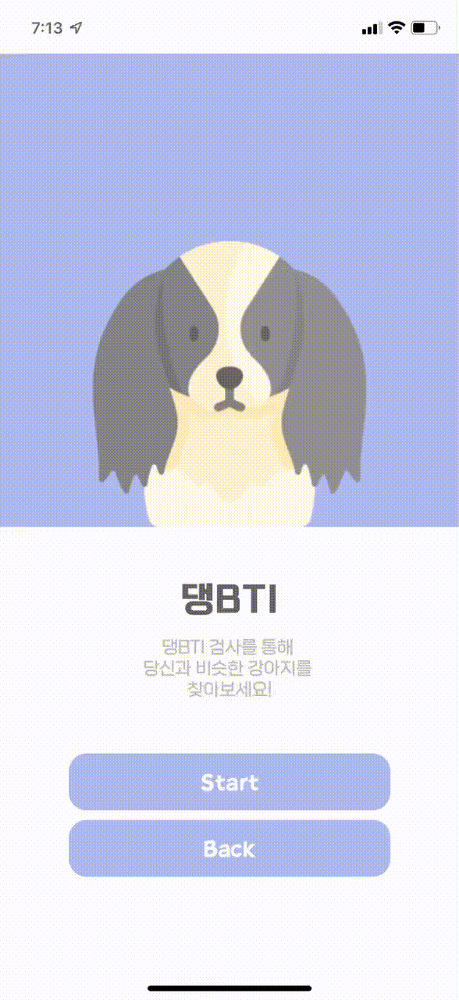
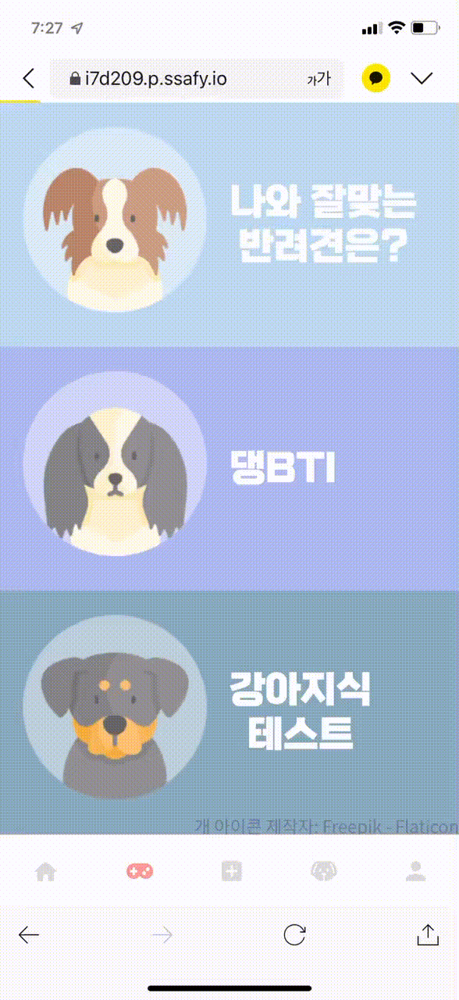
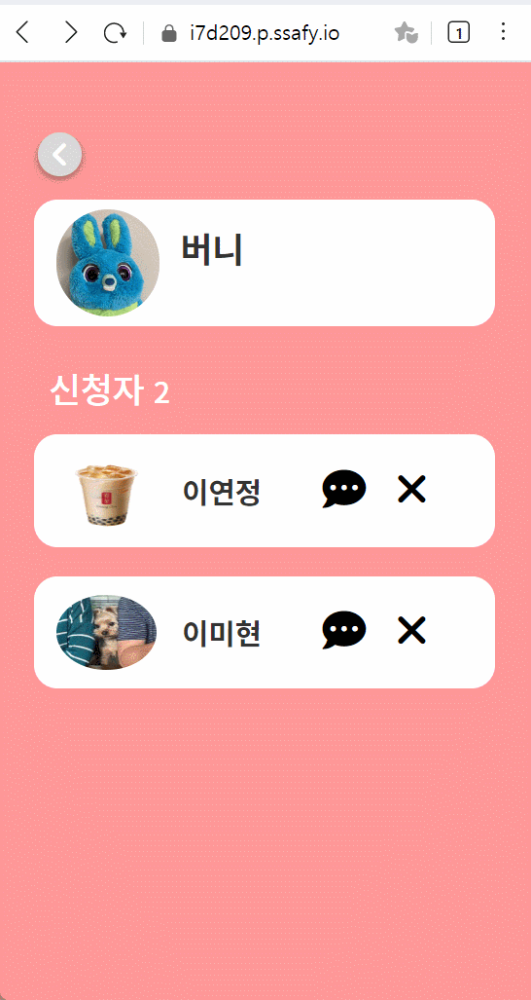
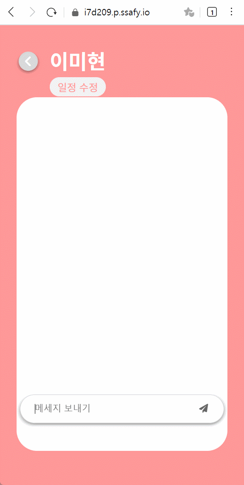
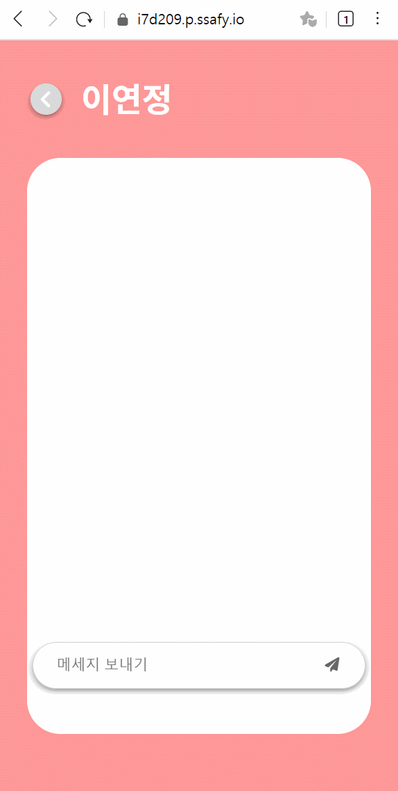
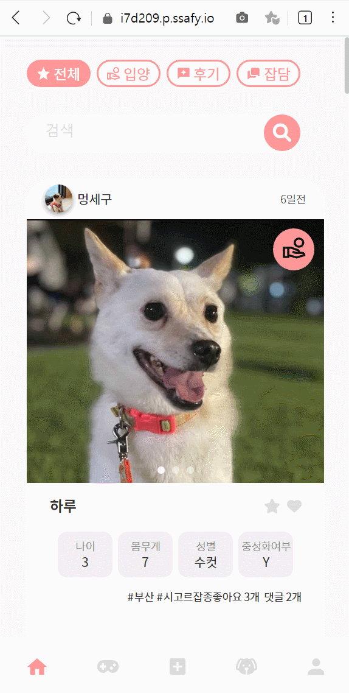
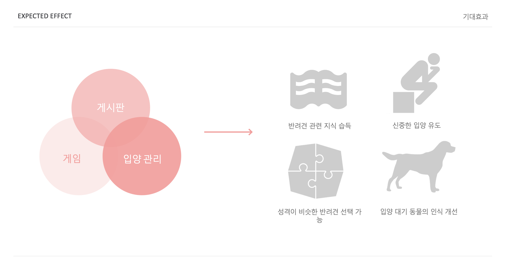
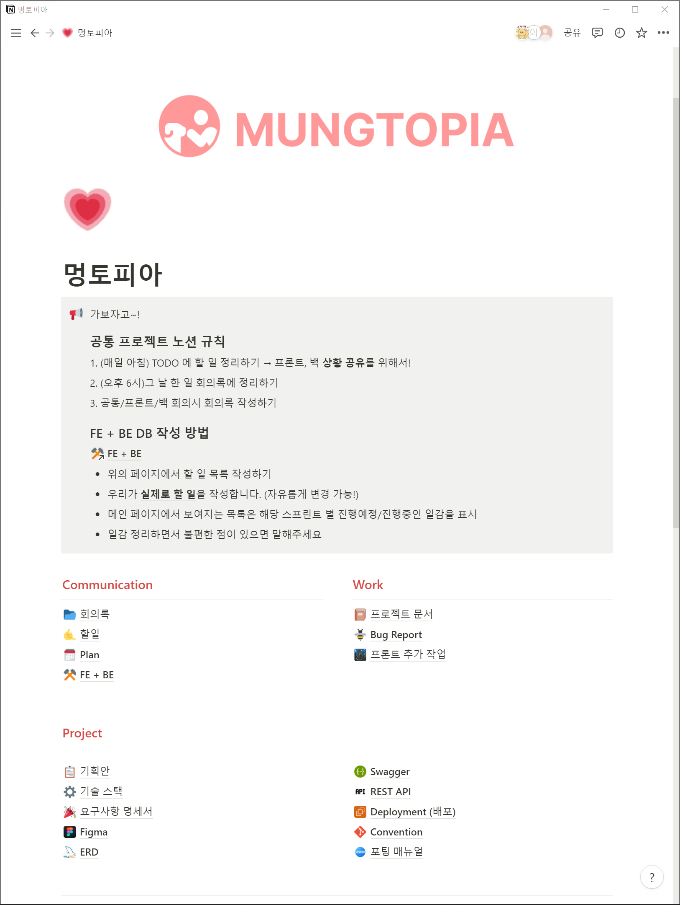
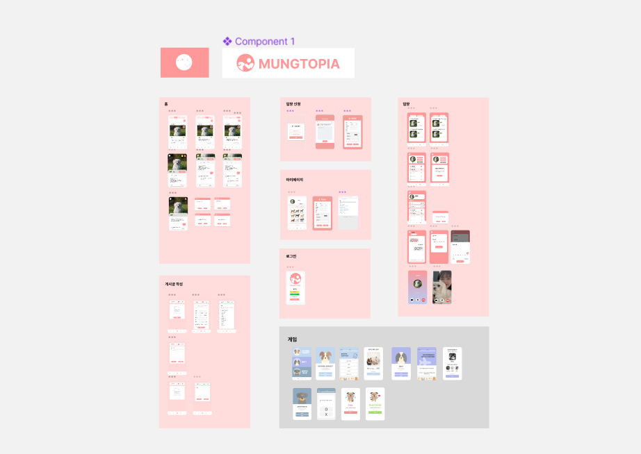
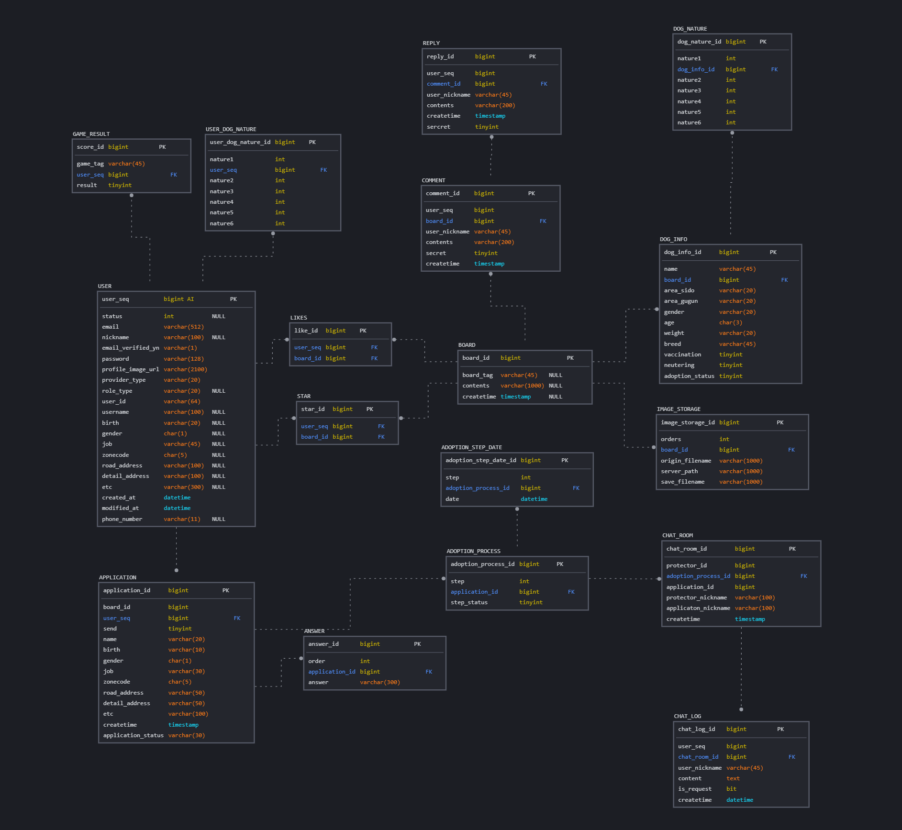

## 📌Index

1. [멍토피아(Mungtopia) 서비스 소개](#🐶멍토피아(Mungtopia)-서비스-소개)
2. [주요 기술 스택](#🔧주요-기술-스택)
3. [개발 기간 및 팀원 역할 소개](#👩‍👩‍👧개발-기간-및-팀원-역할-소개)
4. [프로젝트 산출물](#📚프로젝트-산출물)

# 🐶멍토피아(Mungtopia) 서비스 소개

멍토피아는 '강아지와 함께할 수 있는 유토피아를 꿈꾼다' 라는 뜻을 가지고 있습니다.

멍토피아에서 여러분의 새로운 가족을 만나보세요!

## 주요 서비스 화면
### SNS 형식의 입양/후기/잡담 게시판

  
  
메인 페이지

 

### 게임을 통한 강아지 매칭

✔ 나와 잘 맞는 반려견은?
- 간단한 설문을 통해 게시판에 올라온 입양견 중 나와 가장 잘 맞는 강아지를 추천해줍니다.

✔ 댕BTI
- 내가 강아지라면? 나와 비슷한 성향을 가진 강아지를 알려줍니다.

✔ 강아지식 테스트
- 나는 과연 반려견을 맞이할 준비가 되어있을까? 반려견 상식 테스트

  

    
    
나와 잘 맞는 반려견은?

  

  

    
    
댕BTI

  

  

    
    
강아지식 테스트

  

 

### 입양 신청부터 완료까지 모든 입양 절차를 한 플랫폼에서 진행 가능

✔ 입양신청

  
  
입양신청

✔ 입양신청 - 허가

  
  
입양신청 - 허가

✔ 채팅

  

    
    
보호자 화면

  

  

    
    
입양인 화면

  

✔ 화상미팅

  

    
    
보호자 화면

  

  

    
    
입양인 화면

  

✔ 글 생성

  
  
글 생성

✔ 마이페이지

  
  
마이페이지

 

## 기대효과

# 🔧주요 기술 스택

**Frontend**
- 
- 
- 
- 
- 
- 
- 
- 
​

**Backend**
- 
- 
- 
- 
- 
- 
- 
​

**Infra**
- 
- 
- 
- 

**ETC**
- 
- 
- 

# 👩‍👩‍👧개발 기간 및 팀원 역할 소개

## 개발 기간

2022.07.11 ~ 2022.08.19 (6주)

## 팀원

<table>
    <tr>
        <td height="140px" align="center"> <a href="https://github.com/lea-hwang">
              황희원</a>  
        </td>
        <td height="140px" align="center"> <a href="https://github.com/mhlee21">
              이미현</a>  
        </td>
        <td height="140px" align="center"> <a href="https://github.com/YeonJeongLee00">
              이연정</a>  
        </td>
    </tr>
    <tr>
        <td align="center">
        팀장/Front-End
        </td>
        <td align="center">
        팀원/Back-End
        </td>
        <td align="center">
        팀원/Back-End
        </td>
    </tr>
</table>

## 역할분담
 

  * 목업(Figma) 디자인
  * 컴포넌트 구현 및 CSS(게시판 / 마이페이지 / 입양관리 / 게임 )
  * WebRTC (FE 기능 구현)

  * DB 설계 및 구축 / JPA 도메인 설계
  * 게시판 API 개발
  * 채팅 구현 (STOMP, SockJS)
  * 배포환경 구축 (Docker, Jenkins)
  * WebRTC (Openvidu 서버 배포)

  * DB 설계 및 구축 / JPA 도메인 설계
  * 입양관리 API 개발
  * 소셜로그인 구현 (Spring Security)
  * 배포환경 구축 (Docker, Jenkins)
  * WebRTC (BE 기능 구현)

# 📚프로젝트 산출물
## Notion
👉[Mungtopia 노션 바로가기](https://mountain-failing-553.notion.site/6360b0ee504e46d99089219e36723bc2)

## Mockup

## ERD

